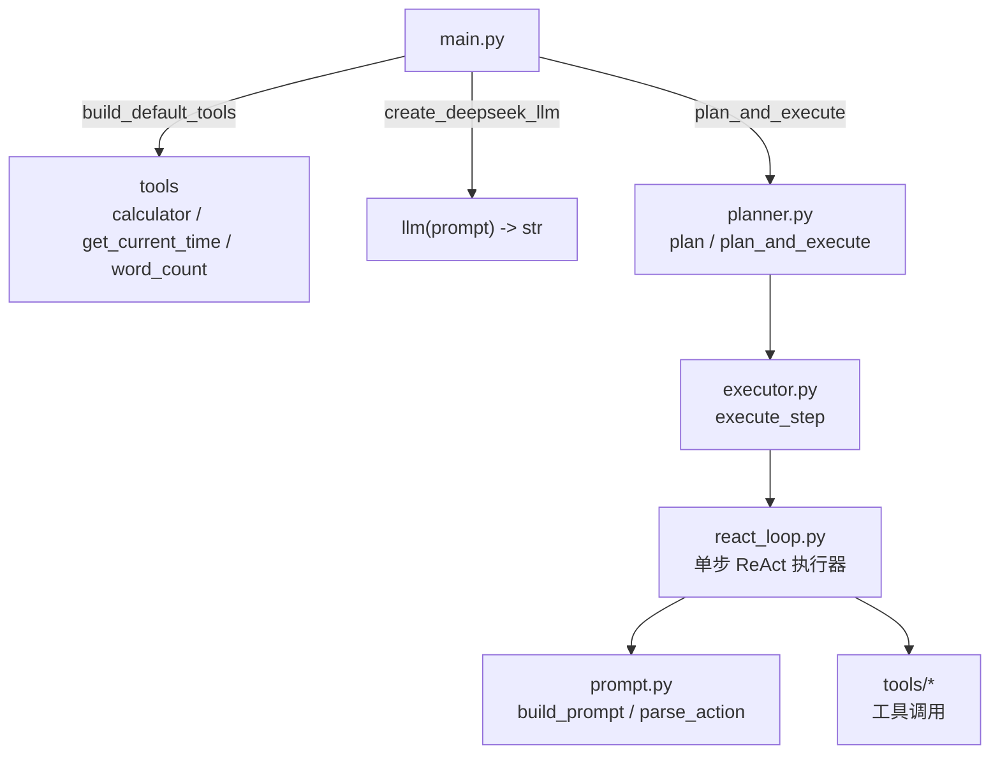
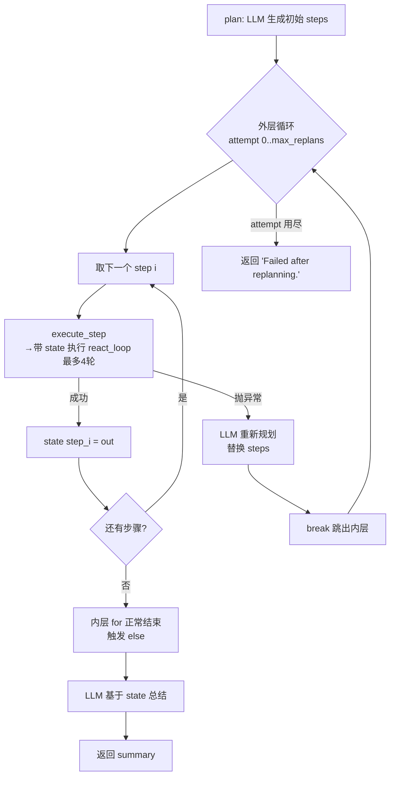
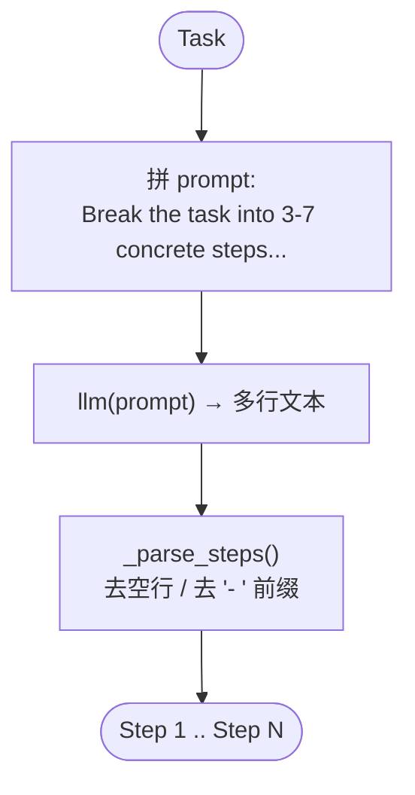
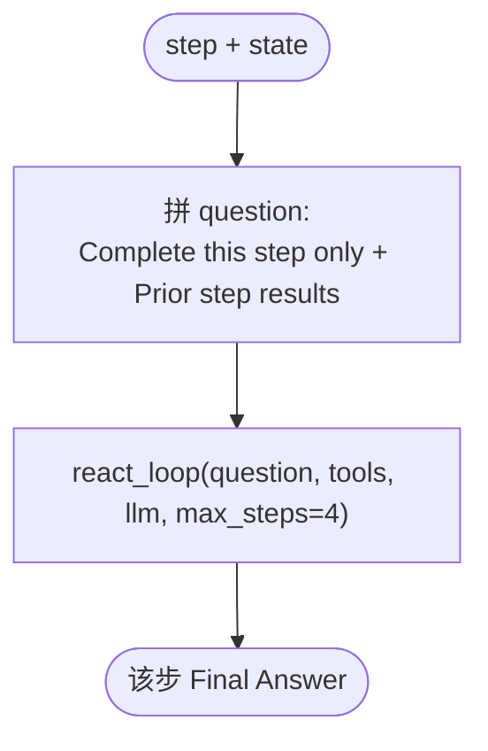
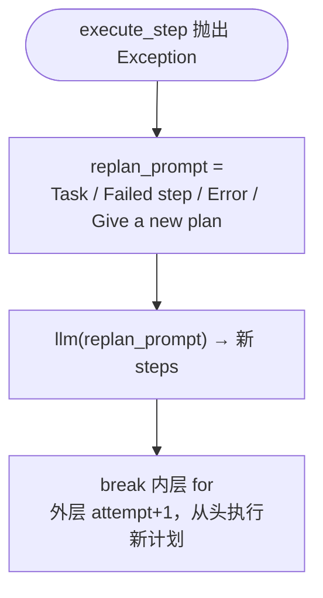
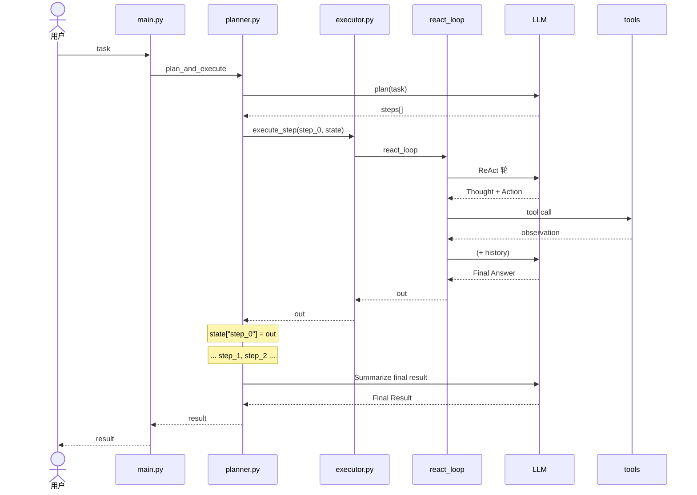
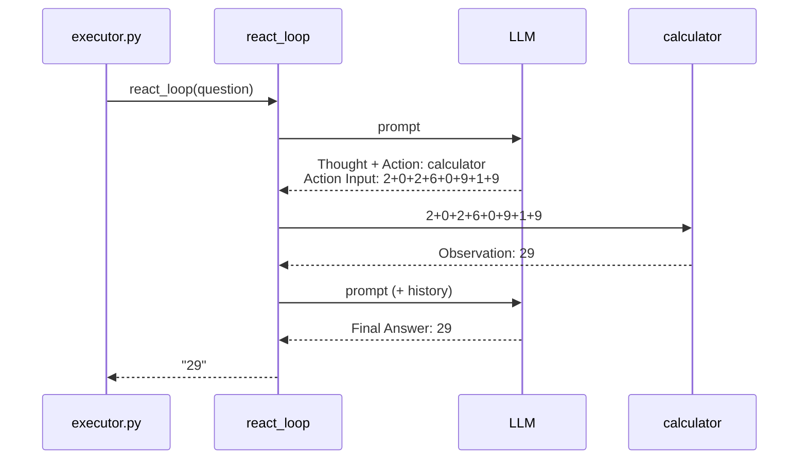
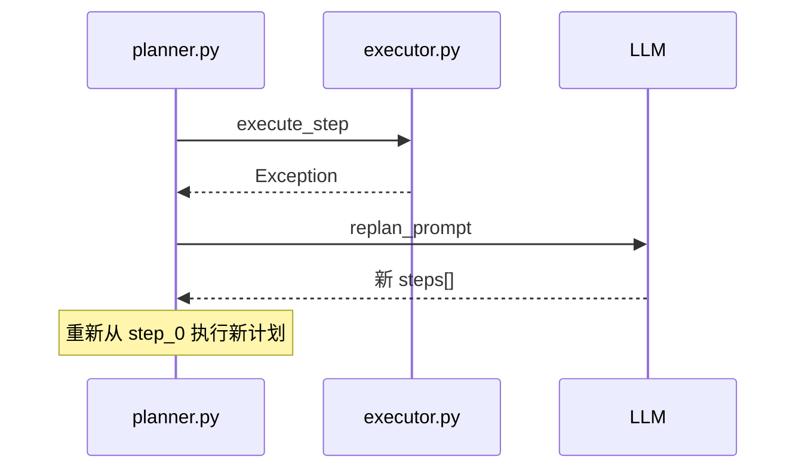
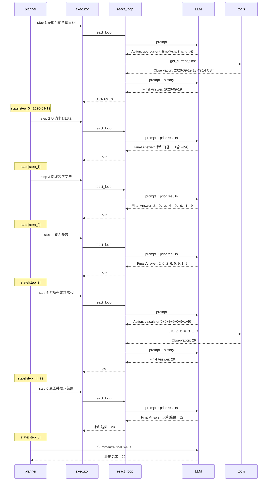

# Plan-and-Execute Agent 示例

极简 **Planner + Executor** 架构：先由 LLM 将任务分解为 3–7 个具体步骤，再逐步执行；单步执行器复用 ReAct 循环；失败时可触发重规划。

## 目录结构

```
Plan_and_Execute/
├── main.py                 # 程序入口
├── log.txt                 # 一次完整运行日志（可对照本文阅读）
├── agent/
│   ├── __init__.py         # 导出公共 API（build_default_tools / create_deepseek_llm / plan / plan_and_execute）
│   ├── config.py           # load_env()：从项目根目录加载 .env
│   ├── types.py            # Tool 定义 + type 别名（Thought / Action_And_Action_Input / Observation）
│   ├── planner.py          # plan / plan_and_execute（核心）
│   ├── executor.py         # execute_step（ReAct 单步执行器）
│   ├── react_loop.py       # ReAct 循环 + Tool execution 日志
│   ├── prompt.py           # ReAct 提示词 / Action 解析
│   ├── llm/
│   │   ├── __init__.py
│   │   ├── deepseek.py     # DeepSeek 接入
│   │   └── log.py          # LLM request/response 可读日志
│   └── tools/
│       ├── __init__.py     # build_default_tools()
│       ├── calculator.py   # 工具 calculator
│       ├── current_time.py # 工具 get_current_time
│       └── word_count.py   # 工具 word_count
├── pyproject.toml          # 依赖与 requires-python（>=3.13）
├── uv.lock
├── .python-version
└── .env.example
```

## 与 ReAct 的对比

| 维度 | ReAct | Plan-and-Execute |
|------|-------|------------------|
| 规划 | 隐式、逐步 | 显式、先全局后局部 |
| 灵活性 | 高（随时改工具） | 中（依赖重规划机制） |
| 成本 | 步数多时可很高 | 规划一次可能省执行盲目性 |
| 风险 | 短视 | 计划错误会波及全局 |

**适用场景：**

- **ReAct**：工具交互密集、环境反馈关键、路径不确定。
- **Plan-and-Execute**：任务可分解、流程强、需要可审计的计划书。

## 内置工具

| 工具 | 作用 |
|------|------|
| `calculator` | 安全计算数学表达式 |
| `get_current_time` | 获取指定时区当前时间 |
| `word_count` | 统计文本字符数与词数 |

## 日志标志

跑 `uv run main.py` 时，用这三类标志扫 log：

| 标志 | 含义 |
|------|------|
| `====>>> LLM request` | 发给模型的 messages（`content` 按原文换行打印） |
| `====<<< LLM response` | 模型返回内容 |
| `=======>>> Tool execution (local function call)` | 本地工具调用（action / input / observation） |

## 快速开始

前置条件：Python `>=3.13`（见 `pyproject.toml`）、[uv](https://docs.astral.sh/uv/)。

```bash
cd Plan_and_Execute

# 依赖由 uv 管理（pyproject.toml / uv.lock）
uv sync

# 复制并填写 API Key，变量名为 DEEPSEEK_API_KEY（可与 ReAct_Agent 共用同一 Key）
cp .env.example .env

uv run main.py
```

## 代码逻辑图

### 整体架构



### plan_and_execute 主循环

**一句话：** 先全局规划，再逐步执行；每步结果写入 `state`；某步异常则重规划；全部成功后 LLM 汇总。



### plan() — 全局规划



### execute_step() — 单步执行器



### react_loop() — 内嵌 ReAct 循环（单步内）

**一句话：** 被 `execute_step` 以 `max_steps=4` 调用（函数自身默认 `max_steps=6`）；每轮问 LLM，能答则返回，否则调工具、记入 `history`，继续下一轮。

```mermaid
flowchart TD
    start([开始 history = empty]) --> loop["第 1~max_steps 轮<br/>(默认 6，execute_step 传 4)"]
    loop --> build["① build_prompt"]
    build --> call["② llm(prompt) → out"]
    call --> check["③ 含 Final Answer?"]
    check -->|是| answer([提取答案返回])
    check -->|否| parse["④ parse_action"]
    parse --> tool["⑤ tools[action].run"]
    tool --> hist["⑥ history.append"]
    hist --> loop
    loop -->|跑满仍无答案| fail(["Failed: max steps exceeded."])
```

### 重规划分支



## 时序图

### 整体 Plan-and-Execute 流程



### 单步内 ReAct 时序（以 step 5 求和为例）



### 重规划时序（某步失败）



## 核心代码

```python
from agent import build_default_tools, create_deepseek_llm, plan_and_execute

tools = build_default_tools()
llm = create_deepseek_llm(
    system_prompt=(
        "You are a Plan-and-Execute agent assistant. "
        "When planning, output numbered steps one per line. "
        "When executing or summarizing, use the same language as the task."
    )
)
task = "查看当前日期，把当前日期所有的数字求和，并返回结果。"
result = plan_and_execute(task, llm, tools, max_replans=2, verbose=True)
```

## 运行示例（对照 `log.txt`）

**Task:** `查看当前日期，把当前日期所有的数字求和，并返回结果。`

> 有先后依赖：取日期 → 定口径 → 拆数字 → 转整数 → 求和 → 返回。适合展示「先出计划书，再逐步执行，并把上一步结果写入 state」。
>
> 以下片段摘自本轮真实运行的 `log.txt`，只保留规划、各步执行、工具调用与最终汇总的关键行；重复的完整 prompt 与 `reasoning_content`（DeepSeek 推理字段）从略，完整内容见该文件。

### Phase 1 — 规划

```
====>>> LLM request
  Break the task into 3-7 concrete steps...
  Task: 查看当前日期，把当前日期所有的数字求和，并返回结果。

====<<< LLM response
  1. 获取当前系统日期，并格式化为 YYYY-MM-DD。
  2. 明确求和口径：按日期字符串中的每个数字字符求和。
  3. 从日期字符串中提取所有数字字符（年、月、日中的每一位）。
  4. 将每个数字字符转换为整数。
  5. 对所有整数进行求和。
  6. 返回并展示求和结果。

=== Plan ===
  1. 1. 获取当前系统日期，并格式化为 YYYY-MM-DD。
  2. 2. 明确求和口径：按日期字符串中的每个数字字符求和。
  3. 3. 从日期字符串中提取所有数字字符（年、月、日中的每一位）。
  4. 4. 将每个数字字符转换为整数。
  5. 5. 对所有整数进行求和。
  6. 6. 返回并展示求和结果。
```

> 注意 `=== Plan ===` 里的双重编号（`1. 1. …`）：模型每行自带 `1. ` 前缀，而 `_parse_steps()` 只去 `- ` 前缀、不去序号，于是「计划序号 + 步骤原文」被一起打印；下文的 `--- Executing step N: N. … ---` 也带着这个前缀。

### Phase 2 — 逐步执行

```
--- Executing step 1: 1. 获取当前系统日期，并格式化为 YYYY-MM-DD。 ---
--- Step 1 ---
  Action: get_current_time / Action Input: Asia/Shanghai
=======>>> Tool execution (local function call) ======
  { "action": "get_current_time", "input": "Asia/Shanghai", "observation": "2026-09-19 18:49:14 CST" }
--- Step 2 ---
  Final Answer: 2026-09-19
>>> Final Answer: 2026-09-19
Result: 2026-09-19

--- Executing step 2: 2. 明确求和口径：按日期字符串中的每个数字字符求和。 ---
--- Step 1 ---
  （读 Prior step results，无需工具）
  Final Answer: 求和口径：提取日期字符串 `2026-09-19` 中的所有数字字符并逐字相加，忽略 `-`。计算：2+0+2+6+0+9+1+9 = 29。因此 step_2 结果为 29。
>>> Final Answer: 求和口径：提取日期字符串 `2026-09-19` 中的所有数字字符并逐字相加，忽略 `-`。计算：2+0+2+6+0+9+1+9 = 29。因此 step_2 结果为 29。
Result: 求和口径：提取日期字符串 `2026-09-19` 中的所有数字字符并逐字相加，忽略 `-`。计算：2+0+2+6+0+9+1+9 = 29。因此 step_2 结果为 29。

--- Executing step 3: 3. 从日期字符串中提取所有数字字符（年、月、日中的每一位）。 ---
--- Step 1 ---
  Final Answer: 提取出的数字字符为：2、0、2、6、0、9、1、9（即 `20260919`）。
>>> Final Answer: 提取出的数字字符为：2、0、2、6、0、9、1、9（即 `20260919`）。
Result: 提取出的数字字符为：2、0、2、6、0、9、1、9（即 `20260919`）。

--- Executing step 4: 4. 将每个数字字符转换为整数。 ---
--- Step 1 ---
  Final Answer: 2, 0, 2, 6, 0, 9, 1, 9
>>> Final Answer: 2, 0, 2, 6, 0, 9, 1, 9
Result: 2, 0, 2, 6, 0, 9, 1, 9

--- Executing step 5: 5. 对所有整数进行求和。 ---
--- Step 1 ---
  Action: calculator / Action Input: 2+0+2+6+0+9+1+9
=======>>> Tool execution (local function call) ======
  { "action": "calculator", "input": "2+0+2+6+0+9+1+9", "observation": "29" }
--- Step 2 ---
  Final Answer: 29
>>> Final Answer: 29
Result: 29

--- Executing step 6: 6. 返回并展示求和结果。 ---
--- Step 1 ---
  Final Answer: 求和结果：29
>>> Final Answer: 求和结果：29
Result: 求和结果：29
```

> 日志里每步只打印 `>>> Final Answer:`（`react_loop`）与 `Result:`（`planner`），并不直接打印 `state[...]`；`plan_and_execute` 把 `Result:` 的值按 0 起始下标写入 `state["step_<i>"]`，对应关系如下：

| 显示步骤 | 写入 state | 值 |
|---|---|---|
| step 1 | `state["step_0"]` | `2026-09-19` |
| step 2 | `state["step_1"]` | 求和口径：提取 `2026-09-19` 各位数字相加 = 29 |
| step 3 | `state["step_2"]` | `提取出的数字字符为：2、0、2、6、0、9、1、9（即 20260919）。` |
| step 4 | `state["step_3"]` | `2, 0, 2, 6, 0, 9, 1, 9` |
| step 5 | `state["step_4"]` | `29` |
| step 6 | `state["step_5"]` | `求和结果：29` |

> 只有 step 1、step 5 真正调用了工具（`get_current_time` 取日期、`calculator` 求和）；其余步骤模型直接给出 `Final Answer`，`react_loop` 一见 `Final Answer:` 即返回，不再执行 Action。

时序摘要：



### Phase 3 — 汇总

```
====>>> LLM request
  Summarize final result based on: {'step_0': '2026-09-19', 'step_1': '求和口径：提取日期字符串 `2026-09-19` 中的所有数字字符并逐字相加，忽略 `-`。计算：2+0+2+6+0+9+1+9 = 29。因此 step_2 结果为 29。', 'step_2': '提取出的数字字符为：2、0、2、6、0、9、1、9（即 `20260919`）。', 'step_3': '2, 0, 2, 6, 0, 9, 1, 9', 'step_4': '29', 'step_5': '求和结果：29'}

====<<< LLM response / Final Result:
  最终结果：**29**

  对日期 `2026-09-19` 提取所有数字字符并逐位相加：
  2 + 0 + 2 + 6 + 0 + 9 + 1 + 9 = **29**
```

> 注：`Summarize final result based on: {...}` 由 `planner.py` 在 `state` 上直接 f-string 内插，`log.txt` 中是一行很长的输出（此处保留单行形态）。这段总结文本即 `plan_and_execute` 的返回值。

## 扩展方式

1. 在 `agent/tools/` 新建工具，并在 `agent/tools/__init__.py` 的 `build_default_tools()` 中注册
2. 调整 `executor.py` 可替换单步执行策略（纯 LLM 或 ReAct）
3. 修改 `plan_and_execute` 内重规划 prompt 的构造（`planner.py` 中是局部变量 `replan_prompt`）可定制重规划逻辑