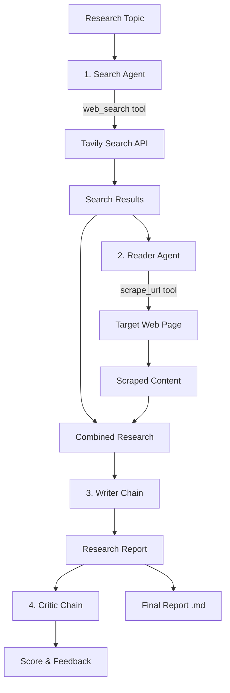

# 🔬 LangChain Multi-Agent Research System

A multi-agent AI research assistant built with **LangChain** and **Streamlit**. Four specialized
components collaborate in sequence — **search**, **read**, **write**, and **critique** — to turn a
single topic into a structured, sourced research report, complete with a critic's score and
feedback.

The web UI streams each pipeline stage as it completes; a CLI entry point runs the same pipeline
end-to-end from the terminal.

---

## ✨ Features

- **Two tool-using agents** — a Search Agent (Tavily) and a Reader Agent (multi-strategy web scraper).
- **Two LLM chains** — a Writer chain that drafts the report and a Critic chain that scores it.
- **Robust scraping** — three fallback extraction strategies so a single failing parser doesn't sink the run.
- **Polished Streamlit UI** — live step cards, expandable raw outputs, and one-click Markdown download.
- **Zero-config model swap** — the LLM is a standard OpenAI-compatible client pointed at DeepSeek.

---

## 🏗 Architecture



### Pipeline stages

| # | Component | Type | Role |
|---|-----------|------|------|
| 1 | **Search Agent** | `create_agent` + `web_search` tool | Finds recent, reliable sources via Tavily (5 results: title, URL, snippet). |
| 2 | **Reader Agent** | `create_agent` + `scrape_url` tool | Picks the most relevant URL and extracts clean article text. |
| 3 | **Writer Chain** | `prompt \| llm \| StrOutputParser` | Drafts a structured report: Introduction, Key Findings, Conclusion, Sources. |
| 4 | **Critic Chain** | `prompt \| llm \| StrOutputParser` | Reviews the report with a `Score: X/10`, strengths, improvements, and a verdict. |

`src/pipelines/pipeline.py` wires these together and returns a `state` dict containing
`search_results`, `search_raw`, `scraped_content`, `report`, and `feedback`.

---

## 📁 Project Structure

```
langchain-multi-agent-research-system/
├── app.py                    # Streamlit web UI (live pipeline cards, download report)
├── main.py                   # CLI entry point (edit `topic` and run)
├── pyproject.toml            # Project metadata & dependencies (uv)
├── uv.lock                   # Locked dependency versions
├── .python-version           # Pinned Python version (3.13)
└── src/
    ├── agents/
    │   └── agents.py         # LLM setup, agent builders, writer & critic chains
    ├── pipelines/
    │   └── pipeline.py       # run_research_pipeline() orchestrating all four stages
    └── tools/
        └── tools.py          # web_search (Tavily) and scrape_url (trafilatura/readability) tools
```

---

## 🚀 Getting Started

### Prerequisites

- **Python 3.13+**
- [**uv**](https://docs.astral.sh/uv/) for dependency management (recommended)
- API keys for **DeepSeek** and **Tavily**

### 1. Install dependencies

```bash
uv sync
```

### 2. Configure environment variables

Create a `.env` file in the project root:

```env
DEEPSEEK_API_KEY=your_deepseek_api_key_here
TAVILY_API_KEY=your_tavily_api_key_here
```

- `DEEPSEEK_API_KEY` — used by the OpenAI-compatible client at `https://api.deepseek.com`.
- `TAVILY_API_KEY` — used by the `web_search` tool.

> ⚠️ Never commit your `.env` file. Add it to `.gitignore` if you haven't already.

### 3. Run

**Web UI (Streamlit):**

```bash
uv run streamlit run app.py
```

Then open the local URL Streamlit prints (usually `http://localhost:8501`), enter a topic, and
click **⚡ Run Research Pipeline**.

**CLI:**

Edit the `topic` in `main.py`, then:

```bash
uv run main.py
```

---

## ⚙️ Configuration

| Setting | Location | Default |
|---------|----------|---------|
| Model | `src/agents/agents.py` | `deepseek-flash` |
| Base URL | `src/agents/agents.py` | `https://api.deepseek.com` |
| Temperature | `src/agents/agents.py` | `0` |
| Search results count | `src/tools/tools.py` | `5` |
| Scrape timeout | `src/tools/tools.py` | `15s` |
| Scraped content cap | `src/tools/tools.py` | `5000` chars |

To point the system at OpenAI or another OpenAI-compatible provider, change `base_url` and
`model` in `src/agents/agents.py`.

---

## 🔧 How It Works

**Search tool** (`web_search`) calls Tavily and formats each hit as a title, URL, and a 300-char
snippet.

**Scraper tool** (`scrape_url`) sanitizes the HTML and tries three extraction strategies in order,
returning the first that yields >200 characters:

1. `trafilatura` — best for articles and blogs.
2. `readability-lxml` — Mozilla Readability port.
3. Full-page fallback — strips `script`/`style`/`nav`/`footer`/`header`/`aside`/`form` and reads
   the remaining text.

Network errors return early with a descriptive message instead of falling through, and each
extraction strategy is isolated so a parser failure degrades gracefully to the next one.

---

## ⚠️ Limitations

- The Reader Agent scrapes a **single** URL per run; there's no multi-source aggregation.
- Paywalled, JavaScript-rendered, or bot-blocked pages may return no meaningful content.
- The pipeline runs synchronously on the request thread — long topics take a while.
- Reports depend on search result quality; verify important claims against the cited sources.

---

## 🧰 Tech Stack

`LangChain` · `LangGraph` (via `create_agent`) · `ChatOpenAI` (DeepSeek) · `Tavily` ·
`trafilatura` · `readability-lxml` · `BeautifulSoup4` · `lxml` · `Streamlit` · `Rich` ·
`python-dotenv`
