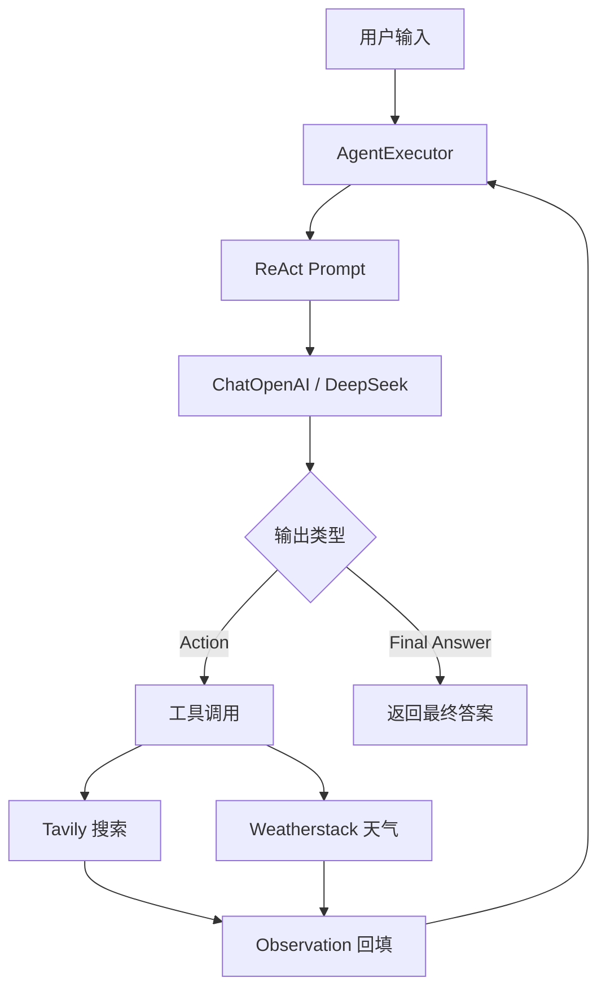

# LangChain Single Agent

一个用 LangChain 构建的**单 Agent（ReAct）**示例：给 LLM 挂上「联网搜索」和「实时天气」两个工具，由模型自己决定先查什么、再查什么。

例如输入 *"Find the capital of Germany and then find its current weather"*，Agent 会先调用搜索工具确定首都是柏林，再把柏林喂给天气工具，最后汇总成一句自然语言答案。

提供两种入口：

- **命令行** —— `main.py`，跑一个固定的演示问题
- **Web UI** —— `app.py`，基于 Streamlit 的对话界面

---

## 功能特性

- **ReAct 推理循环**：`Thought → Action → Observation` 多轮迭代，直到模型给出 `Final Answer`
- **双工具协作**：Tavily 联网搜索 + Weatherstack 实时天气，支持多步链式调用
- **自定义工具**：用 `@tool` 装饰器几行代码就能注册新工具
- **LLM 可替换**：通过 `ChatOpenAI` + `base_url` 接入任何 OpenAI 兼容接口（本项目用 DeepSeek）
- **Streamlit UI**：一个输入框就能交互，带 loading 状态和错误提示

---

## 架构



核心就是用 `langchainhub` 上现成的 `hwchase17/react` 提示词，配合 `create_react_agent` 组装出一条 LCEL 链，再交给 `AgentExecutor` 驱动循环。

---

## 环境要求

- **Python >= 3.13**（见 `.python-version`）
- **uv**（依赖管理与虚拟环境，仓库内含 `uv.lock`）
- 三个 API Key：
  | 变量 | 用途 | 获取地址 |
  | --- | --- | --- |
  | `DEEPSEEK_API_KEY` | 驱动 Agent 的 LLM | https://platform.deepseek.com |
  | `TAVILY_API_KEY` | 联网搜索工具 | https://tavily.com |
  | `WEATHERSTACK_API_KEY` | 天气数据工具 | https://weatherstack.com |

---

## 快速开始

### 1. 配置环境变量

在项目根目录创建 `.env`（已被 `.gitignore` 忽略，不会提交）：

```dotenv
DEEPSEEK_API_KEY=sk-xxxxxxxxxxxxxxxx
TAVILY_API_KEY=tvly-xxxxxxxxxxxxxxxx
WEATHERSTACK_API_KEY=xxxxxxxxxxxxxxxxxxxxxxxx
```

`main.py` 启动时会用 `python-dotenv` 加载它，并在任一变量缺失时直接抛 `RuntimeError`，避免带着空 Key 跑到 API 才报错。

> `TavilySearchResults` 会自动从环境变量读取 `TAVILY_API_KEY`，不需要手动传参。

### 2. 安装依赖

```bash
uv sync
```

### 3. 运行

命令行跑演示问题：

```bash
uv run main.py
```

启动 Web UI：

```bash
uv run streamlit run app.py
```

浏览器打开终端里输出的地址（默认 http://localhost:8501），输入问题后点 **Run Agent**，`verbose=True` 的思考过程也会打印在启动 Streamlit 的那个终端里。

---

## 项目结构

```
langchain-single-agent/
├── main.py             # Agent 定义（工具 / LLM / Prompt / Executor）+ CLI 演示
├── app.py              # Streamlit 前端，直接 import main 里的 agent_executor
├── pyproject.toml      # 依赖声明（版本精确 pin）
├── uv.lock             # 锁文件
├── .python-version     # 3.13
└── README.md
```

`app.py` 依赖 `main.py` 里模块级的 `agent_executor` 对象，所以它 import 时会一并触发 LLM 和 Agent 的初始化。

---

## 工作原理

### 工具定义

```python
search_tool = TavilySearchResults(max_results=2)

@tool
def get_weather_data(city: str) -> str:
    """Fetch current weather information for a city."""
    ...
```

`@tool` 会把函数的**类型标注和 docstring** 变成工具的名称、参数 schema 和描述——描述写得越清楚，模型选工具的准确率越高。

### LLM 与 Prompt

```python
llm = ChatOpenAI(
    base_url="https://api.deepseek.com",
    model="deepseek-flash",
    api_key=SecretStr(DEEPSEEK_API_KEY),
)

prompt = hub.pull("hwchase17/react")
```

`base_url` 指向 DeepSeek，因此复用的是 `langchain-openai` 的客户端。`hub.pull` 会从 LangChain Hub 拉取提示词（首次需要联网，之后走本地缓存）。

### Agent 与执行器

```python
agent = create_react_agent(llm=llm, tools=tools, prompt=prompt)

agent_executor = AgentExecutor(
    agent=cast(BaseSingleActionAgent, agent),
    tools=tools,
    verbose=True,
)
```

`AgentExecutor` 负责循环：把模型输出解析成 Action → 调用对应工具 → 把结果作为 Observation 拼回上下文 → 再次调用模型，直到拿到 Final Answer 或达到 `max_iterations`（默认 15）。

---

## 注意事项

项目 pin 的是 **LangChain 0.1.x**（`langchain-core==0.1.42`、`langchain-openai==0.1.3`），这一代版本有几个容易踩的坑，代码里已经绕过，改动前请留意：

1. **必须从 `langchain_core.pydantic_v1` 导入 `SecretStr`**
   0.1.x 内部用的是 pydantic v1 兼容层，若写 `from pydantic import SecretStr`，类型检查会报 v1/v2 两个同名类不兼容（运行时也可能出问题）。

2. **`agent=cast(BaseSingleActionAgent, agent)` 是为了绕过注解缺口**
   `create_react_agent` 的返回注解是 `Runnable`，而 `AgentExecutor.agent` 只声明了 `BaseSingleActionAgent | BaseMultiActionAgent`。实际上 `AgentExecutor` 有一个 `@root_validator(pre=True)` 会自动把 `Runnable` 包成 `RunnableAgent`，所以 `cast` 运行时是空操作，行为不受影响。

3. **`model="deepseek-flash"` 请确认是当前可用的模型名**
   模型名不对时，DeepSeek 接口会返回 400，用前建议对照官方文档核实。

4. **Weatherstack 免费套餐的 HTTPS 限制**
   若接口返回 `https_access_restricted` 之类的错误，说明当前套餐不支持 HTTPS，需要在 `get_weather_data` 里把 URL 换成 `http://`。

5. **`verbose=True` 会打印完整思考过程**，包含工具入参和原始 Observation，面试或调试时很方便，但生产环境建议关掉或接入日志。

6. **Long-term 方向**：`AgentExecutor + create_react_agent` 是 0.1 时代的写法，新项目建议用 `langgraph.prebuilt.create_react_agent`，直接 `graph.invoke({"messages": [...]})`，不再需要 `AgentExecutor`。
